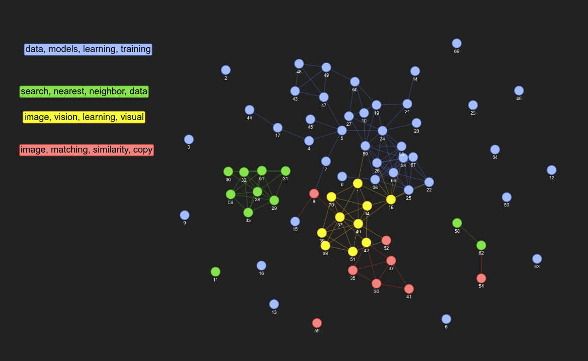
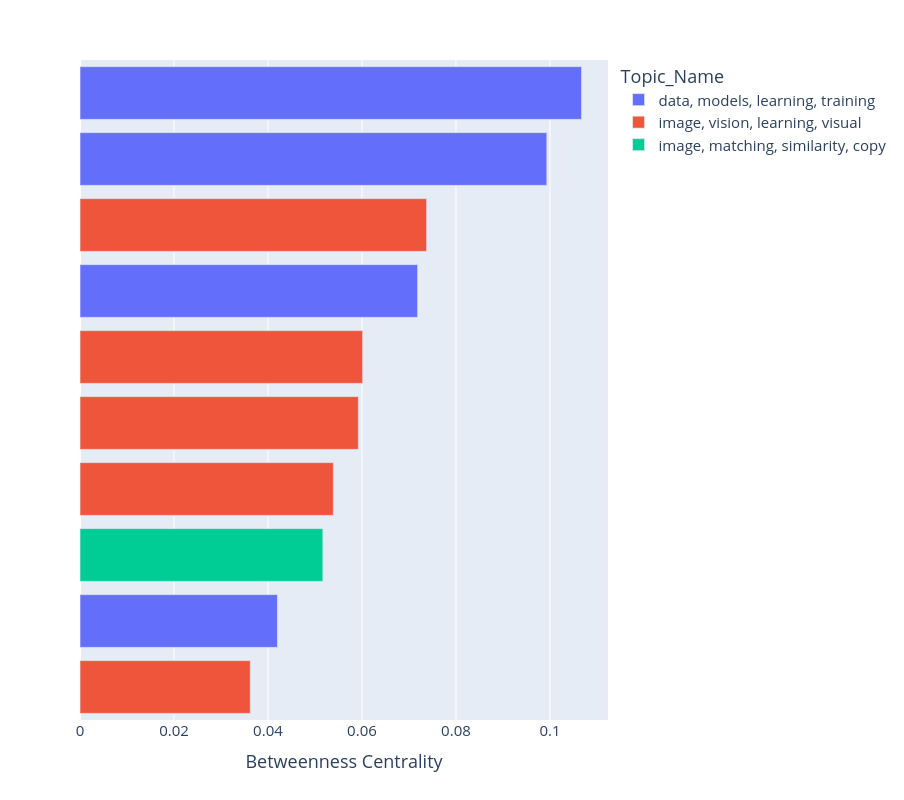

# STriP Net: Semantic Similarity of Scientific Papers (S3P) Network

Leverage the power of NLP Topic Modeling, Semantic Similarity and Network analysis to study the themes and semantical relations within a corpus of research papers.

- This repo was hacked together over the weekend of New Year 2022. 
- It is very much a work in progress. Check back regularly for more updates and features. 
- Please leave a ⭐ to let me know it has been useful to you so that I can dedicate more of my time working on it.

## Install
```
pip install git+https://github.com/stephenleo/stripnet.git
```

## Generate the STriP network analysis on default settings
- STriP can essentially run on any pandas dataframe column containing text. 
- However, the pretrained model is hardcoded (for now), so you'll see the best results while running it on a column that combines the `title` and `abstract` of papers separated by `[SEP]` keyword. Please see below 

```
# Load some data
import pandas as pd
data = pd.read_csv('data.csv')

# Keep only title and abstract columns
data = data[['title', 'abstract']]

# Concat the title and abstract columns separated with [SEP] keyword
data['text'] = data['title'] + '[SEP]' + data['abstract']
```

```
# Instantiate the StripNet
from stripnet import StripNet
stripnet = StripNet()

# Run the StripNet pipeline
stripnet.fit_transform(data['text'])
```

- If everything ran well, your browser should open a new window with the network graph similar to below. The graph is fully interactive! Have fun playing around by hovering over the nodes and moving them around!
- If you are not satisfied with the topics you get, just restart the kernel and rerun it. The Topic Modeling framework has some level of randomness so the topics will change slightly with every run.
- You can also tweak the paremeters of the various models, please look out for the full documentation for the details!



## Find the most important paper
- After you fit the model using the above steps, you can plot the most important papers with one line of code
- The plot is fully interactive too! Hovering over any bar shows the relevant information of the paper.

```
stripnet.most_important()
```



# Acknowledgements
STriP Net stands on the shoulder of giants and several prior work. The most notable being
1. Sentence Transformers [[Paper]](https://arxiv.org/abs/1908.10084) [[Code]](https://www.sbert.net/)
2. AllenAI Specter pretrained model [[Paper]](https://arxiv.org/abs/2004.07180) [[Code]](https://github.com/allenai/specter)
3. BERTopic [[Code]](https://github.com/MaartenGr/BERTopic)
4. Networkx [[Code]](https://networkx.org/)
5. Pyvis [[Code]](https://github.com/WestHealth/pyvis)

# Buy me a coffee
If this work helped you in any way, please consider the following way to give me feedback so I can spend more time on this project
1. ⭐ this repository
2. ❤️ [the Huggingface space ](https://huggingface.co/spaces/stephenleo/strip)
3. ☕ [Buy me a Coffee!](https://www.buymeacoffee.com/stephenleo)